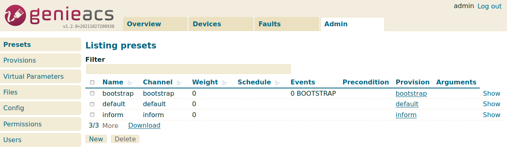

GenieACS
========
Some notes about the installation and configuration of GenieACS.

UI Port:   3000  
ACS URL:   http://\<IP\>:7547/*\<here any path is ok\>*

For testing purpose you can use the client: https://github.com/genieacs/genieacs-sim

Index
-----
1. [Documentation](#Documentation)
2. [Installation](#Installation)
3. [Start script](#Start/Stop/Restart)
4. [Preset](#Preset)
5. [STUN](#STUN)

Documentation
-------------
http://docs.genieacs.com/en/latest/  
https://github.com/genieacs/genieacs/wiki  
https://github.com/genieacs/genieacs-gui/wiki

Installation
------------
For installation, you can follow the the [GenieACS installation guide](http://docs.genieacs.com/en/latest/installation-guide.html), or can copy and past the commands below (for Debian 64bit).

```
sudo -i
apt-get install -y gnupg curl wget

# INSTALL Node.js
curl -fsSL https://deb.nodesource.com/setup_16.x | bash -
apt-get install -y nodejs

# INSTALL MONGO DB
wget -qO - https://www.mongodb.org/static/pgp/server-5.0.asc | apt-key add -
echo "deb http://repo.mongodb.org/apt/debian buster/mongodb-org/5.0 main" > /etc/apt/sources.list.d/mongodb-org-5.0.list
apt-get update
apt-get install -y mongodb-org
apt-get clean

# INSTALL GENIE ACS
npm install -g genieacs

# ADD USER
useradd --system --no-create-home --user-group genieacs

# MAKE FOLDERS
mkdir -p /opt/genieacs/ext
chown genieacs:genieacs /opt/genieacs/ext
touch /opt/genieacs/genieacs.env
chown genieacs:genieacs /opt/genieacs/genieacs.env
chmod 600 /opt/genieacs/genieacs.env
mkdir /var/log/genieacs
chown genieacs:genieacs /var/log/genieacs

# CONFIG
cat << EOL > /opt/genieacs/genieacs.env
GENIEACS_CWMP_ACCESS_LOG_FILE=/var/log/genieacs/genieacs-cwmp-access.log
GENIEACS_NBI_ACCESS_LOG_FILE=/var/log/genieacs/genieacs-nbi-access.log
GENIEACS_FS_ACCESS_LOG_FILE=/var/log/genieacs/genieacs-fs-access.log
GENIEACS_UI_ACCESS_LOG_FILE=/var/log/genieacs/genieacs-ui-access.log
GENIEACS_DEBUG_FILE=/var/log/genieacs/genieacs-debug.yaml
NODE_OPTIONS=--enable-source-maps
GENIEACS_EXT_DIR=/opt/genieacs/ext
EOL
echo "GENIEACS_UI_JWT_SECRET=$(openssl rand -base64 45)" >> /opt/genieacs/genieacs.env

# GENERATE SYSTEMCTL SCRIPTS
cat << EOL > /etc/systemd/system/genieacs-cwmp.service
[Unit]
Description=GenieACS CWMP
After=network.target

[Service]
User=genieacs
EnvironmentFile=/opt/genieacs/genieacs.env
ExecStart=/usr/local/bin/genieacs-cwmp

[Install]
WantedBy=default.target
EOL

cat << EOL > /etc/systemd/system/genieacs-nbi.service
[Unit]
Description=GenieACS NBI
After=network.target

[Service]
User=genieacs
EnvironmentFile=/opt/genieacs/genieacs.env
ExecStart=/usr/local/bin/genieacs-nbi

[Install]
WantedBy=default.target
EOL

cat << EOL > /etc/systemd/system/genieacs-fs.service
[Unit]
Description=GenieACS FS
After=network.target

[Service]
User=genieacs
EnvironmentFile=/opt/genieacs/genieacs.env
ExecStart=/usr/local/bin/genieacs-fs

[Install]
WantedBy=default.target
EOL

cat << EOL > /etc/systemd/system/genieacs-ui.service
[Unit]
Description=GenieACS UI
After=network.target

[Service]
User=genieacs
EnvironmentFile=/opt/genieacs/genieacs.env
ExecStart=/usr/local/bin/genieacs-ui

[Install]
WantedBy=default.target
EOL

# SET LOGROTATE
cat << EOL > /etc/logrotate.d/genieacs
/var/log/genieacs/*.log /var/log/genieacs/*.yaml {
    daily
    rotate 30
    compress
    delaycompress
    dateext
}
EOL

# START
systemctl enable mongod
systemctl start mongod
systemctl status mongod

systemctl enable genieacs-cwmp
systemctl start genieacs-cwmp
systemctl status genieacs-cwmp

systemctl enable genieacs-nbi
systemctl start genieacs-nbi
systemctl status genieacs-nbi

systemctl enable genieacs-fs
systemctl start genieacs-fs
systemctl status genieacs-fs

systemctl enable genieacs-ui
systemctl start genieacs-ui
systemctl status genieacs-ui
```

Start/Stop/Restart
------------------
Little bash script to start/stop/restart GenieACS.

```bash
#!/bin/bash

start () {  
	echo "starting"
	systemctl start genieacs-cwmp
	systemctl start genieacs-nbi
	systemctl start genieacs-fs
	systemctl start genieacs-ui
}

stop () {
	echo "stopping"
	systemctl stop genieacs-cwmp
	systemctl stop genieacs-nbi
	systemctl stop genieacs-fs
	systemctl stop genieacs-ui
}

status () {
	echo "status"
	systemctl status genieacs-cwmp
	systemctl status genieacs-nbi
	systemctl status genieacs-fs
	systemctl status genieacs-ui
}

if [ "$1" = "start" ]; then
	start
elif [ "$1" = "stop" ]; then
	stop
elif [ "$1" = "status" ]; then
	status
elif [ "$1" = "restart" ]; then
	stop
	sleep 2
	start
else
	echo "Usage: $0 {start|stop|restart|status}"
fi
```

Preset
------


- ***Name***  
	Name of Preset
- ***Channel***  
	Channel names are used to group presets such that if an exception happen on one channel, only those presets on that channel are temporarily disabled.
- ***Weight***  
	Presets with higher weight take precedents.
- ***Schedule***  
	If specified, the preset will only be active during the time window specified.
	Cron expression is in the format of: *seconds minute hour day date*.
	*Example:* `3600 0 3 * * 1-5` -> every morning from 3 AM to 4 AM for the months of Jan to May. 
- ***Events***  
	TR069 events that will trigger the preset. Empty means any event. All event must be present \[it works as *AND*\].  
	To exclude an event, prepend - to the event name.  
	*Example for only BOOT:* `-0 BOOTSTRAP,1 BOOT`
- ***Precondition***  
	Precondition that will trigger the Preset, it uses SQL language.  
	*Ex:* `(Device.DeviceInfo.ProductClass = "DEV1" OR Device.DeviceInfo.ProductClass = "DEV2") AND Tags.ToUpgrade IS NULL AND Device.DeviceInfo.SerialNumber <> "S0000000001"`
- ***Provision***  
	The Provisions script that Preset will launch.
- ***Arguments***  
	List of arguments you can pass to the Provision scritp. The arguments can be accessed from the script through the global ``args`` array.  
	*Ex:* "arg1",2,"arg3"

STUN
----
For using STUN, GenieACS needs to read the paramater `UDPConnectionRequestAddress` (Address and port of CPE to which sending UDP Connection Request).
You can add the lines below to your provisioning script.
```
declare('InternetGatewayDevice.ManagementServer.UDPConnectionRequestAddress',{value: 1}).value[0];
declare('Device.ManagementServer.UDPConnectionRequestAddress',{value: 1}).value[0];
```

You need also to configure the UDP port from which GenieACS will send the connection requests in the file: `/opt/genieacs/genieacs.env`
```
GENIEACS_UDP_CONNECTION_REQUEST_PORT=7453
```
